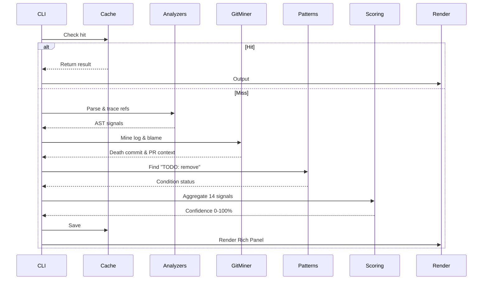

# Architecture

`fossil` is organized as a single Python package (`src/fossil/`) with flat modules for simplicity.

## Module Map

| Module | Purpose |
|--------|---------|
| `cli.py` | Root CLI — command parser, dispatch, error handling, parallel scan |
| `engine.py` | Core orchestration — coordinates analysis → mining → scoring → caching |
| `analyzers.py` | Static analysis — Python `ast` analyzer + text-based fallback for other languages |
| `git_miner.py` | Git history mining — commit traversal, death commit detection, PR extraction |
| `patterns.py` | Pattern detection — "TODO: remove", "keep for now", "DEPRECATED" + condition verification |
| `scoring.py` | Confidence scorer — aggregates all signals into 0–100 score with risk label |
| `render.py` | Output rendering — Rich panel output, Rich tables, plain text fallback, JSON |
| `cache.py` | SQLite cache — analysis results, scan results, PR cache, auto-pruning |
| `config_manager.py` | Config — `~/.config/fossil/config.toml`, `.fossil.toml`, env overrides, masking |
| `repo.py` | Git repo utilities — repo root detection, path resolution, tracked/ignored checks |
| `models.py` | Data models — dataclasses for ForensicResult, StaticAnalysisResult, etc. |

## Data Flow: `fossil explain <file>`

1. CLI parses arguments, resolves file path
2. Cache check: `(file_path, git_HEAD_hash, repo_root)` → cache hit returns immediately
3. `analyzers.py` → static analysis (imports, calls, dynamic refs, reflection)
4. `git_miner.py` → git log traversal, death commit detection, PR extraction
5. `patterns.py` → deferred-deletion pattern detection + condition verification
6. `scoring.py` → weighted signal aggregation → confidence score + risk label
7. `cache.py` → store result for future lookups
8. `render.py` → Rich panel output (or JSON / plain text based on flags)

## Data Flow: `fossil scan <directory>`

1. Enumerate source files (filtered by language, exclusion globs)
2. Parallel analysis via `ThreadPoolExecutor` with Rich progress bar
3. Filter results by confidence threshold
4. Sort by confidence score (descending)
5. Render as Rich table or JSON

## External Dependencies

- **Rich** — Terminal formatting (panels, tables, progress bars, colors)
- **Python `ast`** — Python-specific deep static analysis
- **Python `tomllib`** — TOML config parsing (stdlib, Python 3.11+)
- **Python `sqlite3`** — Local caching (stdlib)
- **git** — Invoked via subprocess for all git operations
